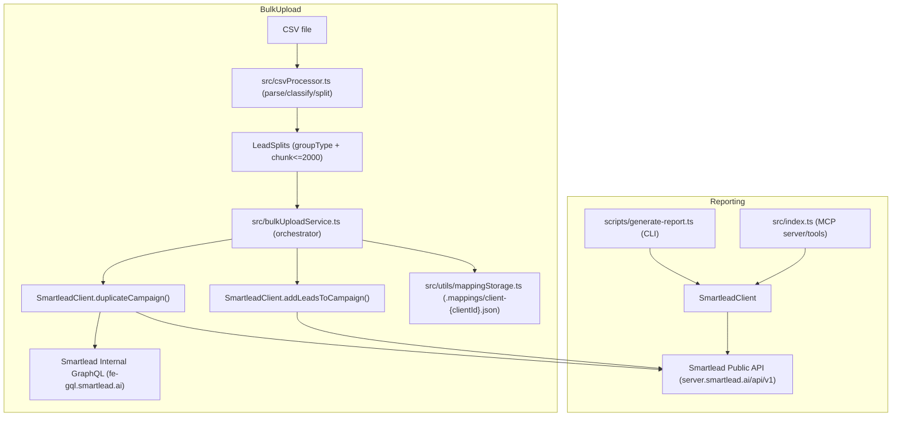

## Smartlead_Helpers — Implementation Guide (Reporting + Bulk Upload + Campaign Cloning)

This project contains two major automation workflows:

- **Reporting**: generate a per-client campaign report (lead status + email stats + per-campaign details)
- **Bulk Upload**: split a large CSV into multiple groups, **duplicate** a template campaign per group/split, apply settings (including **UI-only** settings), then upload leads with duplicate detection + retries

This guide is written so someone can either:

- **Run the repo as-is**, or
- **Re-implement the same system** from scratch (endpoints, algorithms, data flow)

---

## High-level architecture



---

## Setup (for running the existing repo)

### Prereqs

- Node.js **18+**
- A Smartlead **API key**
- Optional: a Smartlead **web app auth token** (JWT) for UI-only settings

### Install

```bash
cd Smartlead_Helpers
npm install
```

### Configure env

Create a `.env` file (do not commit it).

If your repo includes `.env.example`:

```bash
cp .env.example .env
```

If you don’t have `.env.example`, use `env.example` as a starting point:

```bash
cp env.example .env
```

### Environment variables (what they do)

| Variable | Required | Used by | Purpose |
|---|---:|---|---|
| `SMARTLEAD_API_KEY` | ✅ | all | Public API auth (`?api_key=...`) |
| `SMARTLEAD_BASE_URL` | ❌ | all | Public API base URL (default: `https://server.smartlead.ai/api/v1`) |
| `SMARTLEAD_TIMEOUT_MS` | ❌ | all | Request timeout in ms (default: `120000`) |
| `SMARTLEAD_WEB_AUTH_TOKEN` | ❌ | cloning/bulk | Enables internal GraphQL for UI-only settings. Can be with or without the `Bearer ` prefix. |
| `LEAD_LEDGER_DB_PATH` | ❌ | bulk/ledger | Local SQLite “lead ledger” DB path (default: `./data/lead-ledger.sqlite`) |
| `CAMPAIGN_RATE_LIMIT` | ❌ | cloning/bulk | Throttle campaign ops per second (default: `50`) |
| `LEAD_UPLOAD_RATE_LIMIT` | ❌ | bulk | Throttle lead uploads per second (default: `300`) |
| `READ_RATE_LIMIT` | ❌ | reporting/bulk | Throttle reads per second (default: `100`) |
| `BATCH_UPLOAD_CONCURRENCY` | ❌ | bulk | Parallel lead-upload batches (default: `5`) |
| `DUPLICATE_DETECTION_CONCURRENCY` | ❌ | bulk | Parallel pagination requests when fetching existing leads (default: `3`) |
| `CAMPAIGN_DUPLICATION_CONCURRENCY` | ❌ | bulk | Parallel campaign duplications (default: `2`) |
| `SMARTLEAD_CLIENT_ID` | ❌ | `scripts/local-call.ts` | Convenience for local MCP testing |

---

## Reporting (how it works)

### Entry points

- **Standalone CLI (recommended)**: `scripts/generate-report.ts`
  - Run: `npm run report -- --clientId=128520 [--from="YYYY-MM-DD"] [--format=json]`
- **MCP server**: `src/index.ts`
  - Tools: `getClientStatus`, `getLeadStatusBreakdown`, `getCampaignReport`

### Data flow (implementation)

At a high level, reporting does:

1. **List campaigns** for a client (via public API)
2. Optional: **filter campaigns by `created_at`** (if `--from` is passed)
3. For each campaign:
   - Fetch **campaign analytics** (`/campaigns/{id}/analytics`)
   - Fetch **campaign details** (`/campaigns/{id}`)
4. Aggregate into:
   - total campaigns / active / paused
   - lead status buckets (not started / in progress / completed / blocked / stopped)
   - email stats (sent/open/click/reply/bounce)
5. Format as text (CLI) or return structured JSON (CLI + MCP)

If you’re re-implementing: start with `SmartleadClient.getCampaignReport()` in `src/smartleadClient.ts`.

---

## Bulk Upload (how it works)

### What the workflow does

Given:

- A **CSV file** (potentially huge)
- A **source campaign ID** (the “template” campaign to duplicate)
- Optional: a **clientId** for the newly created campaigns

The workflow:

1. Parses and classifies the CSV rows
2. Splits rows into **groups** + **chunks (<= 2000 rows)** to create “splits”
3. Duplicates the template campaign once per split
4. Uploads leads into each duplicated campaign with:
   - **duplicate detection** (skip emails already in that campaign)
   - **batching** (100 leads per API call)
   - **parallel uploads** with concurrency control
   - **retry** for failed batches

### Entry points

- **Code-level orchestration**: `src/bulkUploadService.ts`
- **Standalone runner**: `run-bulk-upload.ts` (edit constants, then run with `npx tsx run-bulk-upload.ts`)
- **MCP tool**: `bulkUploadLeads` in `src/index.ts`

### CSV classification + splitting rules

Implemented in `src/csvProcessor.ts`.

- **ESP detection**: uses `Email Host` column (or `ESP` alias). If it contains “outlook” (case-insensitive), it’s treated as Outlook.
- **Validity detection**: uses `Final Provider` or `Provider`
  - includes “million verifier” → **valid**
  - includes “bounceban” → **catch-all**
- Leads are grouped into 4 buckets:
  - `outlook-valid`
  - `outlook-catchall`
  - `nonoutlook-valid`
  - `nonoutlook-catchall`
- Each group is chunked into **splits of 2000 rows** (default), each becoming a new campaign:
  - Campaign name format: `{sourceName} - {GroupName} {splitNumber}`

### Field mapping (how CSV columns become Smartlead lead fields)

Implemented in `src/utils/fieldMapper.ts` + `src/utils/mappingStorage.ts`.

There are two mapping modes:

- **Auto-detect mode** (no saved mappings):
  - Known columns map to standard fields (`email`, `first_name`, `company_name`, etc.)
  - Unknown columns are stored under `custom_fields`
- **Saved mapping mode** (recommended for repeatable uploads):
  - Per-client mapping is saved in `.mappings/client-{clientId}.json`
  - If a new CSV contains **unmapped columns**, the upload stops and asks you to update mappings (prevents silently dropping data)

How to create/update mappings:

- **Via MCP tools**:
  - `previewCSVMapping` → review auto-detected mappings
  - `saveFieldMapping` → persist corrected mappings for a `clientId`
- **Via script**:
  - Edit and run `save-mapping.ts` (writes to `.mappings/`)

### Campaign duplication (what is copied)

Implemented in `SmartleadClient.duplicateCampaign()` (`src/smartleadClient.ts`).

Copy flow:

1. Validate source campaign (can warn if no schedule/sequences)
2. Fetch source campaign details + sequences
3. Create a new campaign (`POST /campaigns/create`)
4. Copy **public API settings** (`POST /campaigns/{id}/settings`)
5. Copy schedule (`POST /campaigns/{id}/schedule`)
6. Copy sequences (`POST /campaigns/{id}/sequences`) after sanitizing payload
7. Apply **UI-only settings** via internal GraphQL (optional, requires `SMARTLEAD_WEB_AUTH_TOKEN`)
8. Verify (optional) by re-fetching details + sequences

### UI-only settings (AI Categorisation + Bounce Auto-Protection + OOO)

Smartlead’s public API does **not** expose some settings. This repo applies them using Smartlead’s internal GraphQL endpoint:

- URL: `https://fe-gql.smartlead.ai/v1/graphql`
- Auth: `Authorization: Bearer <SMARTLEAD_WEB_AUTH_TOKEN>`

Implementation: `applyUiOnlySettingsGraphql()` inside `src/smartleadClient.ts`.

This repo uses a **hybrid approach**:

- **Fixed (from config)**:
  - `ai_categorisation_options`
  - `auto_categorise_reply`
  - `bounce_autopause_threshold`
  - Configure in: `src/campaignUiSettings.ts`
- **Copied from the source campaign**:
  - `out_of_office_detection_settings`

Important limitation:

- The nested UI checkbox **“Force plain text as content type”** is **not** exposed via public API or GraphQL (see `UI-SETTINGS-CONFIG.md`). It must be set manually in the Smartlead UI.

### Lead upload (batching, concurrency, retries, duplicate detection)

Implemented in `SmartleadClient.addLeadsToCampaign()` (`src/smartleadClient.ts`).

- Fetch existing leads from the campaign via `/campaigns/{id}/leads` (with pagination)
- Build a `Set` of existing emails (lowercased)
- Filter out duplicates before upload
- Split into **batches of 100** (API limit)
- Upload batches in parallel with `BATCH_UPLOAD_CONCURRENCY`
- Retry failed batches (up to 3 tries per batch) and then a final retry pass

---

## Script inventory (what to run)

### Reporting

- `scripts/generate-report.ts` — generate formatted report (text or JSON)
- `scripts/local-call.ts` — starts MCP server and calls `getCampaignReport` once (quick local test)

### Bulk upload / cloning

- `run-bulk-upload.ts` — end-to-end bulk upload runner (edit constants then run)
- `save-mapping.ts` — saves per-client field mappings to `.mappings/`

### Lead ledger / retargeting

- `scripts/ledger-init.ts` — initialize the local SQLite lead ledger (optional; auto-created on first write)
- `scripts/ledger-record-upload.ts` — record a manual Smartlead UI upload into the ledger
- `scripts/ledger-export-retarget.ts` — export retarget-ready leads to a clean CSV (e.g., “uploaded 90+ days ago”)
- `scripts/ledger-import-clients.ts` — import/upsert `clientId → clientName` mappings into the ledger (optional)

### Debugging / inspection helpers

- `scripts/list-clients.ts` — derives client IDs from campaigns
- `scripts/find-campaign.ts` — locate campaign by name/id (helper)
- `scripts/fetch-campaign-settings.ts` — dumps campaign settings (public API)
- `scripts/analyze-har.ts` + `scripts/capture-api-calls.md` — for capturing Smartlead UI network calls (when needed)

---

## Lead ledger (retargeting)

Smartlead exports add system columns (status, IDs, timestamps, etc.), so they’re not a reliable copy of the CSV you uploaded.
This repo maintains a **local SQLite lead ledger** as the source of truth so you can:

- Track **which emails** were uploaded to **which campaign** and **when**
- Re-export a clean retarget CSV later (without deleting Smartlead-added columns)

### How the ledger is populated
- **Automatic (bulk upload)**: `BulkUploadService` records each successful upload event right after `SmartleadClient.addLeadsToCampaign()`.
- **Manual UI uploads**: run `scripts/ledger-record-upload.ts` using the same CSV you uploaded in the Smartlead UI.

### Retarget export
Export “eligible again” leads based on **last uploaded_at <= now - N days**.

Example (90 days):

```bash
npm run ledger:export -- --days=90 --out="./exports/retarget.csv"
```

Optional: filter by last campaign:

```bash
npm run ledger:export -- --days=90 --campaignId=2818135 --out="./exports/retarget.csv"
```

Optional: filter by Smartlead client:

```bash
npm run ledger:export -- --days=90 --clientId=128520 --out="./exports/retarget.csv"
```

By default, invalid/unsubscribed emails (when known from upload responses) are excluded.

---
## If you need to re-implement this from scratch (checklist)

1. **Config**
   - Load env vars for API key, base URL, timeouts, and optional web auth token
2. **Public API client**
   - GET campaigns, campaign details, analytics, leads (with pagination)
   - POST create campaign, update settings, update schedule, save sequences, add leads
3. **Campaign cloning**
   - Implement step-by-step duplication with retries + optional verification
   - Sanitize sequences payloads to avoid validation errors
4. **Internal GraphQL (optional but needed for full parity)**
   - Implement `POST https://fe-gql.smartlead.ai/v1/graphql`
   - Apply UI-only settings (AI categorisation, bounce threshold, OOO settings)
5. **CSV pipeline**
   - Parse CSV → classify into 4 buckets → chunk into splits → name campaigns
6. **Lead upload pipeline**
   - Duplicate detection (existing emails Set)
   - Batch size 100
   - Parallel uploads + retries
7. **Reporting**
   - For each campaign, fetch analytics + details, then aggregate into a report

---

## Troubleshooting (common issues)

### “Missing SMARTLEAD_API_KEY”

- Create `.env` and set `SMARTLEAD_API_KEY`

### UI-only settings not applying

- Ensure `SMARTLEAD_WEB_AUTH_TOKEN` is set (token can expire; refresh from browser DevTools)
- Confirm `duplicateCampaign()` is not called with `skipUiOnlySettings: true`

### “Field mappings not found” (bulk upload)

- Create mappings for the client first:
  - run `save-mapping.ts`, or
  - use MCP tools `previewCSVMapping` + `saveFieldMapping`

### “New/unmapped columns detected in CSV”

- Update the saved mapping to include the new columns (prevents silently losing custom fields)

