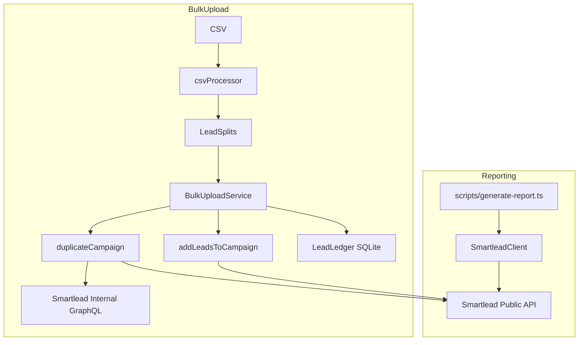

# Smartlead_Helpers — Overview (what it does, how to run it, how it’s built)

This repo is your automation “glue” around **Smartlead**:

- **Reporting**: generate a per-client campaign report (lead status + email stats + per-campaign details)
- **Bulk Upload**: CSV → classify + split → duplicate template campaigns → upload leads (with dedupe + batching + retries)
- **UI-only settings**: apply Smartlead settings not exposed in the public API (via internal GraphQL)
- **Lead ledger**: keep a local “source of truth” of what you uploaded per campaign/client, so you can retarget later without fighting Smartlead export columns

If you want deeper internals, see `IMPLEMENTATION_GUIDE.md`. If you want quick commands, start here.

---

## What you can do (capabilities)

### Reporting (Smartlead → human-readable report)
- Generate a client report via CLI: `npm run report -- --clientId=<ID> [--from=YYYY-MM-DD] [--format=json]`
- Or run as an MCP server (`npm run dev`) and call tools programmatically.

### Bulk upload (CSV → multiple Smartlead campaigns)
- Parses a big CSV, classifies leads into groups (Outlook/Non-Outlook × Valid/Catchall), and chunks into splits (<= 2000 rows per split).
- Duplicates a template campaign once per split.
- Uploads leads with:
  - **dedupe vs existing campaign leads**
  - **batch size 100** (Smartlead limit)
  - **parallel uploads + retry**

### UI-only campaign settings (GraphQL)
Some settings aren’t in Smartlead’s public API (examples: **AI categorisation**, **bounce auto-protection**, some OOO toggles).  
This repo can apply them using the Smartlead web app’s internal GraphQL endpoint when you provide `SMARTLEAD_WEB_AUTH_TOKEN`.

### Lead ledger (retargeting / “what have we already sent?”)
Smartlead exports add extra system columns, so they’re not the same artifact you uploaded.  
This repo maintains a local **SQLite ledger** that records:
- which emails were uploaded to which campaign/client
- uploaded timestamp (used as your “90 day clock”)
- original CSV row data (stored as JSON) so exports stay clean

---

## Operator quickstart (commands you actually run)

From `Smartlead_Helpers/`:

### 1) Setup
```bash
cp .env.example .env || cp env.example .env
npm install
```

Required env:
- `SMARTLEAD_API_KEY`

Optional env:
- `SMARTLEAD_WEB_AUTH_TOKEN` (UI-only settings)
- `LEAD_LEDGER_DB_PATH` (defaults to `./data/lead-ledger.sqlite`)

### 2) Reporting
```bash
npm run report -- --clientId=128520
npm run report -- --clientId=128520 --from="2025-12-17"
npm run report -- --clientId=128520 --format=json > report.json
```

### 3) Bulk upload
Fastest path is editing `run-bulk-upload.ts` (CSV path + sourceCampaignId + clientId), then:
```bash
npx tsx run-bulk-upload.ts
```

### 4) Lead ledger (recommended workflow)
Import/update client list (optional but useful for readability):
```bash
npm run ledger:clients
```

Record a manual Smartlead UI upload into the ledger (when you didn’t use scripts):
```bash
npm run ledger:record -- --clientId=128520 --campaignId=2818135 --csv="/path/to/uploaded.csv"
```

Export retarget-ready leads (90+ days since last upload) **per client**:
```bash
npm run ledger:export -- --clientId=128520 --days=90 --out="./exports/retarget.csv"
```

---

## Conceptual model (data flow)



---

## Local data artifacts (what gets written to disk)

### Saved field mappings
- Folder: `.mappings/`
- Files: `client-<clientId>.json`
- Purpose: make CSV → Smartlead field mapping repeatable. If a CSV introduces new columns, the bulk upload will stop and ask you to update mappings (prevents silent data loss).

### Lead ledger DB
- Default path: `data/lead-ledger.sqlite` (override with `LEAD_LEDGER_DB_PATH`)
- Key tables (simplified):
  - `ledger_uploads`: one row per upload event (includes `client_id`, `campaign_id`, `uploaded_at`)
  - `ledger_upload_leads`: emails + original row JSON per upload event
  - `ledger_lead_status`: mark invalid/unsubscribed when known
  - `ledger_clients`: `clientId → clientName` mapping

---

## Code map (where to change behavior)

### Core modules
- `src/smartleadClient.ts`
  - Public API wrapper, report aggregation, campaign duplication, lead upload with dedupe/batching
- `src/bulkUploadService.ts`
  - Orchestrates CSV → splits → duplicate → upload (and records to ledger best-effort)
- `src/csvProcessor.ts`
  - CSV parsing, classification, grouping, splitting rules
- `src/utils/fieldMapper.ts` + `src/utils/mappingStorage.ts`
  - Field mapping detection + saved mapping persistence
- `src/leadLedger.ts`
  - SQLite schema + record/query/export logic

### Entry points / scripts
- Reporting: `scripts/generate-report.ts`
- Bulk upload runner: `run-bulk-upload.ts`
- Ledger scripts:
  - `scripts/ledger-init.ts`
  - `scripts/ledger-record-upload.ts`
  - `scripts/ledger-export-retarget.ts`
  - `scripts/ledger-import-clients.ts` (default file: `data/clients.tsv`)

---

## Operational gotchas / FAQs

### “Why does Smartlead export add columns?”
Because exports represent Smartlead’s internal lead records (status, timestamps, IDs, reply/bounce metadata). They aren’t meant to be a byte-for-byte copy of your upload. Use the **lead ledger** as your source of truth.

### “What if a lead is uploaded twice?”
The ledger records multiple upload events per email. Retarget eligibility uses the **most recent upload** per email (and you should export with `--clientId` to avoid cross-client mixing).

### “Why do UI-only settings require a token?”
Those settings are saved through Smartlead’s web app GraphQL endpoint. Public API doesn’t expose them.

---

## Where to go next
- `README.md` — commands + setup
- `GETTING-STARTED.md` — bulk upload quickstart
- `IMPLEMENTATION_GUIDE.md` — deep internals + endpoints + algorithms
- `UI-SETTINGS-CONFIG.md` — UI-only settings notes/limitations

